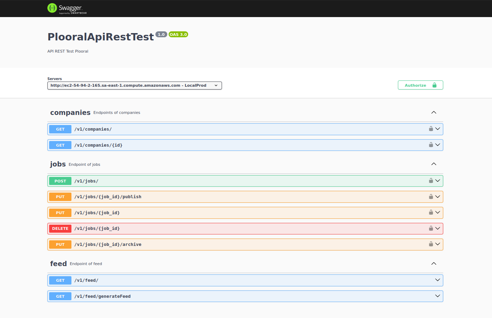

# Backend Developer Technical Assessment
## Backend Challenge

<p align="center">
    
</p>

This project is an API built using **JavaScript, NodeJs, PostgreSQL, AWS S3, AWS Lambda function, AWS RDS and AWS EC2 .**

## Table of Contents

- [Installation](#installation)
- [API Endpoints](#api-endpoints)
- [Documentation](#documentation)
- [Testing](#testing)

## Installation

1. Clone the repository:

```bash
git clone https://github.com/thomasgsquinaia/backend-developer-test.git
```

2. Switch to the "thomasquinaia" branch:

```bash
git switch thomasquinaia
```

3. Make sure you have the latest version of the project:

```bash
git pull origin thomasquinaia
```

4. Install the dependencies:

```bash
npm install
```

5. Run the project

```bash
npm run dev
```

## API Endpoints
The API provides the following endpoints:

**API COMPANIES**
```markdown
GET /v1/companies - List existing companies.
GET /api/companies/:company_id - Fetch a specific company by ID.
```

**API JOBS**
```markdown
POST /v1/jobs - Create a job posting draft.
PUT /v1/jobs/:job_id/publish - Publish a job posting draft.
PUT /jobs/:job_id - Edit a job posting draft (title, location, description).
PUT /jobs/:job_id/archive - Archive an active job posting.
DELETE /jobs/:job_id - Delete a job posting draft.
```

**API FEED**
```markdown
GET /v1/feed - List feed file from cache.
GET /v1/feed/generateFeed - Generate Feed.
```

## Documentation

After clicking on the link, change the "Servers" to "http://ec2-54-94-2-165.sa-east-1.compute.amazonaws.com" to avoid any problems.

```bash
http://ec2-54-94-2-165.sa-east-1.compute.amazonaws.com/v1/doc/
```

## Testing

1. Run the project: 

```bash
npm run dev
```

2. Run the test:

```bash
npm run test:all
```
